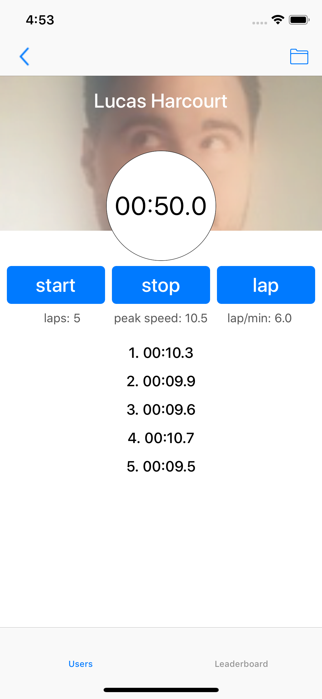
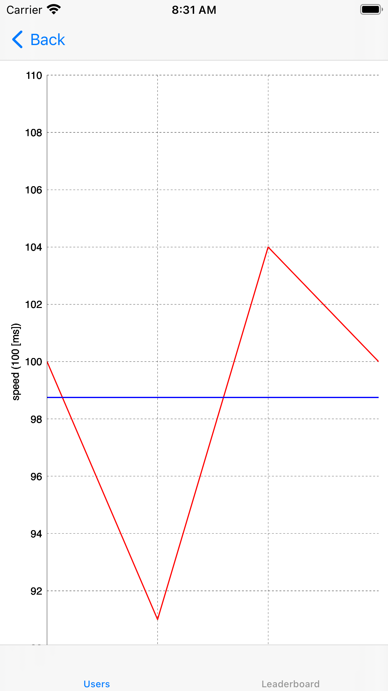
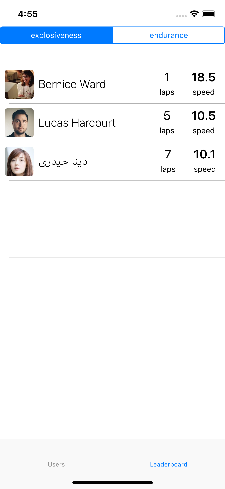
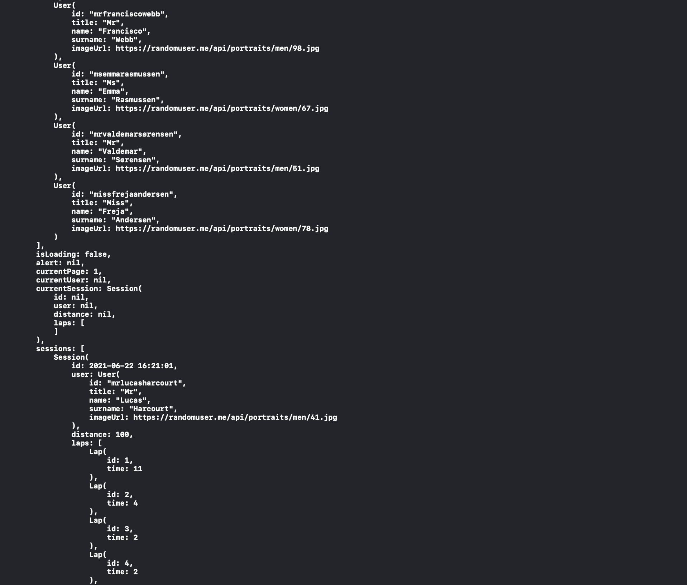

# CoachTimer


## Installation

To run the project, clone the repo, and run `pod install` from the root directory first.

```ruby
pod install
```

<table>
  <tr>
      <td></td>
      <td></td>
   </tr> 
   <tr>
      <td></td>
      <td></td>
  </tr>
</table>

## Architecture

__CoachTimer__ is based on my personal library [RxComposableArchitecture](https://github.com/jrBordet/RxComposableArchitecture) that is inspired by [The Composable Architecture](https://github.com/pointfreeco/swift-composable-architecture).

[RxComposableArchitecture](https://github.com/jrBordet/RxComposableArchitecture) is a modern _Rx_ library for building applications in a consistent way, with composition and testing.

Usually developers come to __Functional Reactive Programming__ whith just in mind the idea of "reactive", or that everything is a stream of data. Basically it's true but there is a caveat. In fact we should remember that we are working in __functional__ world, which means that we should keep in mind some principle as __state immutability__. 

__state immutability__ is a misleading concept . Obviously the state should change, in fact our aim is to transform informations. But we must do it in a consistent way. And this is where come from the idea of the Composable Architecture.


Every feature is defined by some types and values that model your domain:

* __State__: A type that describes the data your feature needs to perform its logic and render its UI.
* __Action__: A type that represents all of the actions that can happen in your feature, such as user actions, http requests, access to a DB and more.
* __Environment__: A type that holds any dependencies the feature needs, such as API clients, analytics clients, and more.
* __Reducer__: A function that describes how to evolve the current state of the app to the next state given an action. The reducer is also responsible for returning any effects that should be run, such as API requests, which can be done by returning an Effect value.
* __Store__: The runtime that actually drives your feature. You send all user actions to the store so that the store can run the reducer and effects, and you can observe state changes in the store so that you can update UI.

The benefits of doing this is that you will instantly unlock testability of your feature, and you will be able to break large, complex features into smaller domains that can be glued together.

### User list feature

The State

```swift 
struct UsersState {
	var list: [User]
	var isLoading: Bool
	var alert: String?
	var currentPage: Int
	var currentUser: User?
}
```

The Actions

```swift 
public enum UsersAction: Equatable {
	case purge
	case load
	case loadResponse([User])
	case fetch
	case fetchResponse([User])
	case persistUsers
	case persistUsersResponse(Bool)
	case selectUser(User?)
}
```

The Environment


```swift 
public struct UsersEnvironment {
    // load users from a local storage
	var loadUsers: () -> Effect<[User]>
    
    // fetch users from remote
	var fetch: () -> Effect<[User]>
    
    // persist locally a collection of User
	var persistUsers: ([User]) -> Effect<Bool>
}

```

The reducer

```swift 
public func usersReducer(
	state: inout UsersState,
	action: UsersAction,
	environment: UsersEnvironment
) -> [Effect<UsersAction>] {
	switch action {
	case .fetch:
		state.isLoading = true
		
		return [
			environment.fetch().map { UsersAction.fetchResponse($0) }
		]
        ...
    }
}
```

As you can see the enviromnet resolve extrenally the effect and then return the result in an action handled by the reducer.

```environment.fetch().map { UsersAction.fetchResponse($0) }```

### Testing

#### Integration Tests

Basically in CoachTimer we have just a couple of layer for the "effects"

	* networking layer: check NetworkingTests
	* file client layer: check FileClientTests
	

#### Behaviour Testing

To test, we first need to create a mock for the __Environment__ with the same information that the __reducer__ needs to solve depedencies.


```swift
	let env_filled = UsersEnvironment(
		fetch: {
			.just([
				.sample,
				.sample_1
			])
		},
		persistUsers: { users in
			.just(true)
		},
		loadUsers: {
			.just([])
		}
	)
```

An then we should create an initial domain for our feature.


```swift
		let initalState = UsersState(
			list: [],
			isLoading: false,
			alert: nil,
			currentUser: nil
		)
```
And then we are ready for testing
        
```swift

		assert(
			initialValue: initalState,
			reducer: usersReducer,
			environment: env_filled,
			steps: 
            // try to load information locally
            Step(.send, UsersAction.load, { state in
				
			}),
            // the response is empty
			Step(.receive, UsersAction.loadResponse([]), { state in
				
			}),
             // then perform a http request that return two users
			Step(.receive, UsersAction.fetchResponse([.sample, .sample_1]), { state in
				state.list = [
					.sample,
					.sample_1
				]
				state.isLoading = false
				state.currentPage = 2
			}),
            // persiste the response locally
			Step(.receive, UsersAction.persistUsersResponse(true), { state in
				
			})
		)

```

### Debug

The Coach Timer App comes with a logging function to aid in debugging. With reference to Application+Store.swift 

```swift
var applicationStore: Store<AppState, AppAction> =
  Store(
	initialValue: initialAppState,
	reducer: with(
	  appReducer,
	  compose(
		customLogging,
		activityFeed
	)),
	environment: AppEnvironment.live
)
```

In the debug console we can see the State of the entire app on each status change.



## Frameworks


| Pod               | Version         
| -------------     |:-------------:| 
| RxSwift           | 5.0.x         |
| RxCocoa           | 5.0.x         |
| RxDataSources     | 4.0.x         |


### Personal libraries


| Pod                       | Version         
| -------------             |:-------------:| 
| SceneBuilder              | 1.0.0         |
| RxComposableArchitecture  | 2.1.3         |


### Pods for testing

| Pod                            | Version         
| -------------                  |:-------------:| 
| RxComposableArchitectureTests  | 2.1.3         |
| SnapshotTesting | 1.7.2|


## Author

Jean Raphaël Bordet, jr.bordet@gmail.com
